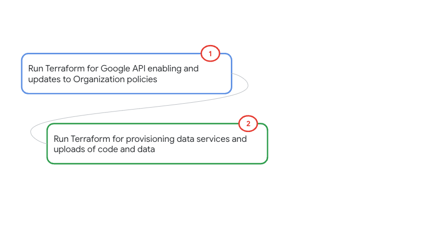
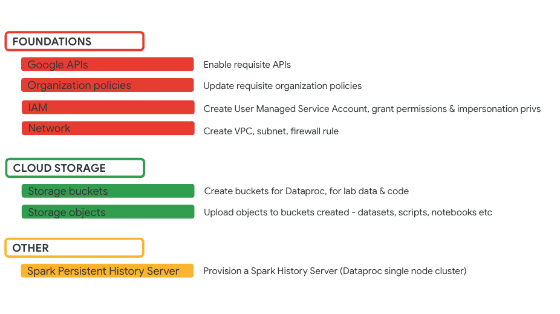

# Module-01: Infrastructure provisioning

In this module we will create the requisite infrastructure for the lab with Terraform. <br>

<hr>

## 1. About 

### 1.1. Duration
It takes ~15 minutes to complete and is fully scrpited, including with Terraform for provisioning.

### 1.2. Platform for provisioning

Your machine, or preferably Cloud Shell.

### 1.3. Prerequisites
- A pre-created project
- You need to have organization admin rights, and project owner privileges or work with privileged users to complete provisioning.


### 1.4. Lab flow

   
<br><br>

### 1.5. Resources provisioned

   
<br><br>

<hr>

## 2. Foundational resources provisioning with Terraform

In this section we will enable the requisite Google APIs and update organizational policies with Terraform.<br>
Takes approximately 5 minutes to complete.

### 2.1. Clone this repo in Cloud Shell

```
git clone https://github.com/anagha-google/dataproc-labs.git
```

### 2.2. Run Terraform

The Terraform in this section updates organization policies and enables Google APIs.

Paste this in Cloud Shell
```
PROJECT_ID=`gcloud config list --format "value(core.project)" 2>/dev/null`

cd ~/dataproc-labs/4-dataproc-with-gpu/provisioning-automation/foundations-tf
```

Run the Terraform for organization policy edits and enabling Google APIs
```
terraform init
terraform apply \
  -var="project_id=${PROJECT_ID}" \
  -auto-approve >> 4-dataproc-with-gpu-tf-foundations.output
```

Wait till the provisioning completes - ~10 minutes or less. <br>

In a separate cloud shell tab, you can tail the output file for execution state through completion-
```
tail -f  ~/dataproc-labs/4-dataproc-with-gpu/provisioning-automation/foundations-tf/4-dataproc-with-gpu-tf-foundations.output
```

<hr>

## 3. Core resources provisioning automation with Terraform

This section provisions all the requisite core data services for the lab, and their dependecies.

### 3.1. Resources provisioned

In this section, we will provision or complete the following-

1. Network, subnet, firewall rule
2. Storage buckets for code, datasets, and for use with the services
3. Persistent Spark History Server
4. User Managed Service Account
5. Requisite IAM permissions
6. Copy of code, data, etc into buckets


### 3.2. Run the terraform scripts
Paste this in Cloud Shell after editing the GCP region variable to match your nearest region-

```
cd ~/dataproc-labs/4-dataproc-with-gpu/provisioning-automation/core-tf/terraform

PROJECT_ID=`gcloud config list --format "value(core.project)" 2>/dev/null`
PROJECT_NBR=`gcloud projects describe $PROJECT_ID | grep projectNumber | cut -d':' -f2 |  tr -d "'" | xargs`
PROJECT_NAME=`gcloud projects describe ${PROJECT_ID} | grep name | cut -d':' -f2 | xargs`
GCP_ACCOUNT_NAME=`gcloud auth list --filter=status:ACTIVE --format="value(account)"`
GCP_REGION="us-central1"
DEPLOYER_ACCOUNT_NAME=$GCP_ACCOUNT_NAME
ORG_ID=`gcloud organizations list --format="value(name)"`
CC2_IMAGE_VERSION="composer-2.0.11-airflow-2.2.3"

#Run the Terraform for provisioning the rest of the environment
terraform init
terraform apply \
  -var="project_id=${PROJECT_ID}" \
  -var="project_name=${PROJECT_NAME}" \
  -var="project_number=${PROJECT_NBR}" \
  -var="gcp_account_name=${GCP_ACCOUNT_NAME}" \
  -var="deployment_service_account_name=${DEPLOYER_ACCOUNT_NAME}" \
  -var="org_id=${ORG_ID}" \
  -var="cloud_composer_image_version=${CC2_IMAGE_VERSION}" \
  -var="gcp_region=${GCP_REGION}" \
  -auto-approve >> 4-dataproc-with-gpu-tf-core.output
```
  
Takes ~10 minutes to complete.<br> 


In a separate cloud shell tab, you can tail the output file for execution state through completion-

```
tail -f ~/dataproc-labs/4-dataproc-with-gpu/provisioning-automation/core-tf/terraform/4-dataproc-with-gpu-tf-core.output
```

<hr>

This concludes the lab module. Proceed to the next module.

<hr>
<hr>
