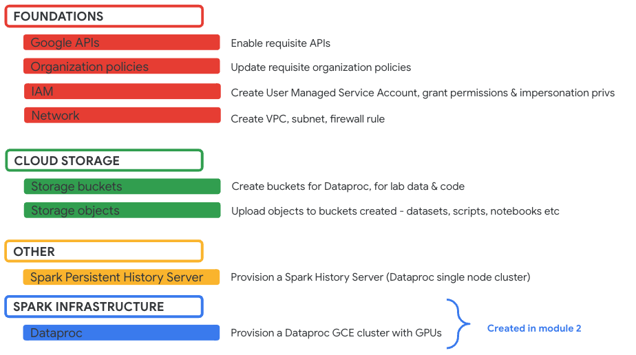
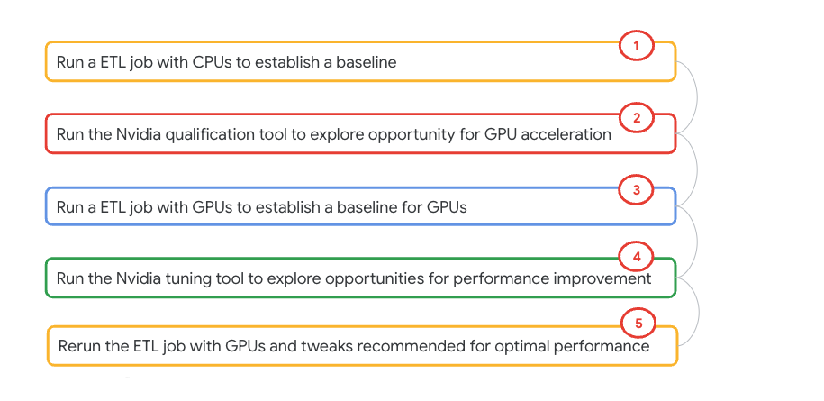
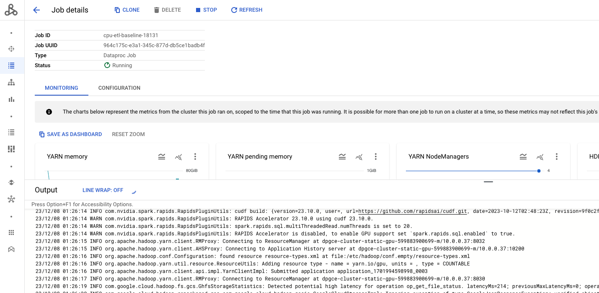

# Module 02: GPU acceleration for Spark on Dataproc GCE clusters 

This lab module demystifies Spark application acceleration with Spark-RAPIDS on Dataproc on GCE - powered by Nvidia GPUs through a minimum viable Spark application on the Kaggle Telco Customer Churn dataset. It also introduces Nvidia tooling - for qualifying Spark applications that can benefit from GPU acceleration as well as Nvidia tuning tool to further enhance GPU powered Spark application performance.

<hr>
<hr>

## 1. About the lab

### 1.1. Prerequisites

Successful completion of prior module

<hr>

### 1.2. What to expect

In this lab, we will-
1. Create a Dataproc cluster with GPUs
2. Generate data
3. Run an ETL job with just CPUs to establish a baseline performance
4. Run the Nvidia qualification tool to identify opportunities for GPU acceleration for our ETL CPU baseline job
5. Run the same ETL job with GPUs and establish a baseline performance
6. Run the Nvidia tuning tool to understand tweaks that can further improve performance
7. Rerun the same ETL job with GPUs with the Nvidia tuning recommendations
8. Study the results
9. Shut down resources

<hr>

### 1.3. Resources provisioned

We will provision a Dataproc on GCE cluster with GPUs.

   

<hr>

### 1.4. Lab flow

   

<hr>

### 1.5. Duration

~ 2 hours but does not require focus time.

<hr>
<hr>


## 2. Provision a Dataproc on GCE cluster


### 2.1. Declare variables

Paste in Cloud Shell-
```
PROJECT_ID=`gcloud config list --format "value(core.project)" 2>/dev/null`
PROJECT_NBR=`gcloud projects describe $PROJECT_ID | grep projectNumber | cut -d':' -f2 |  tr -d "'" | xargs`

DATAPROC_CLUSTER_NAME=dpgce-cluster-static-gpu-${PROJECT_NBR}
DPGCE_LOG_BUCKET=spark-bucket-dpgce-${PROJECT_NBR}
DATA_BUCKET=data_bucket-${PROJECT_NBR}
CODE_BUCKET=code_bucket-${PROJECT_NBR}
VPC_NM=VPC=vpc-$PROJECT_NBR
SPARK_SUBNET=spark-snet
UMSA_FQN=lab-sa@$PROJECT_ID.iam.gserviceaccount.com
REGION=us-central1
ZONE=us-central1-b
NUM_GPUS=1
NUM_WORKERS=4
```

<hr>

### 2.2. Create a DPGCE cluster with GPUs

Paste in Cloud Shell-

```
gcloud dataproc clusters create $DATAPROC_CLUSTER_NAME  \
    --region $REGION \
    --zone $ZONE \
    --image-version=2.0-ubuntu18 \
    --master-machine-type=n1-standard-4 \
    --num-workers=$NUM_WORKERS \
    --worker-accelerator=type=nvidia-tesla-t4,count=$NUM_GPUS \
    --worker-machine-type=n1-standard-8 \
    --num-worker-local-ssds=1 \
    --initialization-actions=gs://goog-dataproc-initialization-actions-${REGION}/spark-rapids/spark-rapids.sh \
    --optional-components=JUPYTER,ZEPPELIN \
    --metadata gpu-driver-provider="NVIDIA",rapids-runtime="SPARK" \
    --subnet=$SPARK_SUBNET \
    --enable-component-gateway  \
    --bucket $DPGCE_LOG_BUCKET \
    --service-account $UMSA_FQN   
```

Takes approximately ~12 minutes or less to provision. Largely because of scripts that need to run to install drivers and such.

<hr>

### 2.3. Quick pictorial walk-through of the cluster

   

Scroll below to [appendix](Lab-Module-02.md#walkthrough-of-the-dataproc-cluster) for complete walkthrough of the cluster.

<hr>
<hr>

## 3. Review the lab dataset

The dataset is the famous Kaggle Telco Customer Churn dataset - small data. Review the same.

Paste in Cloud Shell-
```
head -10 ~/dataproc-labs/4-dataproc-with-gpu/provisioning-automation/core-tf/datasets/telco-customer-churn.csv
```

Author's sample output-
```
customerID,gender,SeniorCitizen,Partner,Dependents,tenure,PhoneService,MultipleLines,InternetService,OnlineSecurity,OnlineBackup,DeviceProtection,TechSupport,StreamingTV,StreamingMovies,Contract,PaperlessBilling,PaymentMethod,MonthlyCharges,TotalCharges,Churn
7590-VHVEG,Female,0,Yes,No,1,No,No phone service,DSL,No,Yes,No,No,No,No,Month-to-month,Yes,Electronic check,29.85,29.85,No
5575-GNVDE,Male,0,No,No,34,Yes,No,DSL,Yes,No,Yes,No,No,No,One year,No,Mailed check,56.95,1889.5,No
3668-QPYBK,Male,0,No,No,2,Yes,No,DSL,Yes,Yes,No,No,No,No,Month-to-month,Yes,Mailed check,53.85,108.15,Yes
7795-CFOCW,Male,0,No,No,45,No,No phone service,DSL,Yes,No,Yes,Yes,No,No,One year,No,Bank transfer (automatic),42.3,1840.75,No
9237-HQITU,Female,0,No,No,2,Yes,No,Fiber optic,No,No,No,No,No,No,Month-to-month,Yes,Electronic check,70.7,151.65,Yes
9305-CDSKC,Female,0,No,No,8,Yes,Yes,Fiber optic,No,No,Yes,No,Yes,Yes,Month-to-month,Yes,Electronic check,99.65,820.5,Yes
1452-KIOVK,Male,0,No,Yes,22,Yes,Yes,Fiber optic,No,Yes,No,No,Yes,No,Month-to-month,Yes,Credit card (automatic),89.1,1949.4,No
6713-OKOMC,Female,0,No,No,10,No,No phone service,DSL,Yes,No,No,No,No,No,Month-to-month,No,Mailed check,29.75,301.9,No
7892-POOKP,Female,0,Yes,No,28,Yes,Yes,Fiber optic,No,No,Yes,Yes,Yes,Yes,Month-to-month,Yes,Electronic check,104.8,3046.05,Yes
```

<hr>
<hr>

## 4. Generate a larger dataset off of the base lab dataset

The script (generate_data.py) provided to us by Nvidia creates a larger dataset. We will use the same to generate a large dataset. <br>

### 4.1. Review the size of the base dataset

Paste in Cloud Shell-
```
PROJECT_ID=`gcloud config list --format "value(core.project)" 2>/dev/null`
PROJECT_NBR=`gcloud projects describe $PROJECT_ID | grep projectNumber | cut -d':' -f2 |  tr -d "'" | xargs`
DATA_BUCKET=data_bucket-${PROJECT_NBR}

gsutil du -s -h -a gs://$DATA_BUCKET/churn/input/telco-customer-churn.csv | cut -d' ' -f1,2
```
Its 954 KiB.

### 4.2. Review the PySpark data generator script

Paste in Cloud Shell-
```
cd ~/dataproc-labs/4-dataproc-with-gpu/provisioning-automation/core-tf/scripts/pyspark/data-generator-util
cat generate_data.py
```

### 4.3. Declare variables
Paste in Cloud Shell-
```
PROJECT_ID=`gcloud config list --format "value(core.project)" 2>/dev/null`
PROJECT_NBR=`gcloud projects describe $PROJECT_ID | grep projectNumber | cut -d':' -f2 |  tr -d "'" | xargs`

DATAPROC_CLUSTER_NAME=dpgce-cluster-static-gpu-${PROJECT_NBR}
DPGCE_LOG_BUCKET=spark-bucket-dpgce-${PROJECT_NBR}
DATA_BUCKET=data_bucket-${PROJECT_NBR}
CODE_BUCKET=code_bucket-${PROJECT_NBR}
VPC_NM=VPC=vpc-$PROJECT_NBR
SPARK_SUBNET=spark-snet
UMSA_FQN=lab-sa@$PROJECT_ID.iam.gserviceaccount.com
REGION=us-central1
ZONE=us-central1-b
NUM_GPUS=1
NUM_WORKERS=4

LOG_SECOND=`date +%s`
LAB_LOG_ROOT_DIR="~/dataproc-labs/logs/lab-4/"
mkdir -p $LAB_LOG_ROOT_DIR
LOGFILE="$LAB_LOG_ROOT_DIR/$0.txt.$LOG_SECOND"


# This is used to define the size of the dataset that is generated
# 10000 will generate a dataset of roughly 25GB in size
SCALE=10

# Set this value to the total number of cores that you have across all
# your worker nodes. 
TOTAL_CORES=32
#
# Set this value to 1/4 the number of cores listed above. Generally,
# we have found that 4 cores per executor performs well.
NUM_EXECUTORS=8   # 1/4 the number of cores in the cluster
#
NUM_EXECUTOR_CORES=$((${TOTAL_CORES}/${NUM_EXECUTORS}))
#
# Set this to the total memory across all your worker nodes. e.g. RAM of each worker * number of worker nodes
TOTAL_MEMORY=120   # unit: GB
DRIVER_MEMORY=4    # unit: GB
#
# This takes the total memory and calculates the maximum amount of memory
# per executor
EXECUTOR_MEMORY=$(($((${TOTAL_MEMORY}-$((${DRIVER_MEMORY}*1000/1024))))/${NUM_EXECUTORS}))

# Source base data file to be bulked up
INPUT_FILE="gs://data_bucket-${PROJECT_NBR}/churn/input/telco-customer-churn.csv"
# *****************************************************************
# Output prefix is where the data that is generated will be stored.
# This path is important as it is used for the INPUT_PREFIX for
# the cpu and gpu env files
# *****************************************************************
#
OUTPUT_PREFIX="gs://data_bucket-${PROJECT_NBR}/churn/input/10scale/"
```

### 4.4. Run the data generator script from Nvidia

Paste in Cloud Shell-
```
gcloud dataproc jobs submit pyspark \
--cluster $DATAPROC_CLUSTER_NAME \
--id data-generator-$RANDOM \
gs://$CODE_BUCKET/churn/data-generator-util/generate_data.py \
--py-files=gs://$CODE_BUCKET/churn/aux_etl_code_archive.zip \
--properties="spark.executor.cores=${NUM_EXECUTOR_CORES},spark.executor.memory=${EXECUTOR_MEMORY}G,spark.driver.memory=${DRIVER_MEMORY}G" \
--configuration="spark.cores.max=$TOTAL_CORES,spark.task.cpus=1,spark.sql.files.maxPartitionBytes=2G" \
--region $REGION \
--project $PROJECT_ID \
-- --input-file=${INPUT_FILE} --output-prefix=${OUTPUT_PREFIX} --dup-times=${SCALE}  2>&1 >> $LOGFILE
```

Review the job execution in Dataproc -> Jobs UI

   

<hr>

   

<hr>

   

<hr>

### 4.5. Review the 10 scale lab dataset generated

Paste in Cloud Shell-
```
gsutil ls $OUTPUT_PREFIX
```

Lets check the size-
```
gsutil du -s -h -a ${OUTPUT_PREFIX} | cut -d' ' -f1,2
```
The author's output is 42.46 MiB

<hr>
<hr>

## 5. Run an ETL job on CPUs for a baseline performance capture

### 5.1. Declare variables

Paste in Cloud Shell-
```
PROJECT_ID=`gcloud config list --format "value(core.project)" 2>/dev/null`
PROJECT_NBR=`gcloud projects describe $PROJECT_ID | grep projectNumber | cut -d':' -f2 |  tr -d "'" | xargs`

DATAPROC_CLUSTER_NAME=dpgce-cluster-static-gpu-${PROJECT_NBR}
DPGCE_LOG_BUCKET=spark-bucket-dpgce-${PROJECT_NBR}
DATA_BUCKET=data_bucket-${PROJECT_NBR}
CODE_BUCKET=code_bucket-${PROJECT_NBR}
VPC_NM=VPC=vpc-$PROJECT_NBR
SPARK_SUBNET=spark-snet
UMSA_FQN=lab-sa@$PROJECT_ID.iam.gserviceaccount.com
REGION=us-central1
ZONE=us-central1-b
NUM_GPUS=1
NUM_WORKERS=4

LOG_SECOND=`date +%s`
LAB_LOG_ROOT_DIR="~/dataproc-labs/logs/lab-4/"
mkdir -p $LAB_LOG_ROOT_DIR
LOGFILE="$LAB_LOG_ROOT_DIR/$0.txt.$LOG_SECOND"

# Set this value to the total number of cores that you have across all
# your worker nodes. e.g. 8 servers with 40 cores = 320 cores
TOTAL_CORES=32
#
# Set this value to 1/4 the number of cores listed above. Generally,
# we have found that 4 cores per executor performs well.
NUM_EXECUTORS=8  # 1/4 the number of cores in the cluster
#
NUM_EXECUTOR_CORES=$((${TOTAL_CORES}/${NUM_EXECUTORS}))
#
# Set this to the total memory across all your worker nodes. e.g. RAM of each worker * number of worker nodes
TOTAL_MEMORY=120   # unit: GB
DRIVER_MEMORY=4    # unit: GB
#
# This takes the total memory and calculates the maximum amount of memory
# per executor
EXECUTOR_MEMORY=$(($((${TOTAL_MEMORY}-$((${DRIVER_MEMORY}*1000/1024))))/${NUM_EXECUTORS}))

# Input prefix designates where the data to be processed is located
INPUT_PREFIX="gs://data_bucket-$PROJECT_NBR/churn/input/10scale/"
#
# Output prefix is where results from the queries are stored
OUTPUT_PREFIX="gs://data_bucket-$PROJECT_NBR/churn/output/cpu-based-analytics/"
```

### 5.2. Run a Spark analytics application on CPUs for a baseline

Paste in Cloud Shell-
```
SPARK_PROPERTIES="spark.executor.cores=${NUM_EXECUTOR_CORES},spark.executor.memory=${EXECUTOR_MEMORY}G,spark.driver.memory=${DRIVER_MEMORY}G,spark.cores.max=$TOTAL_CORES,spark.task.cpus=1,spark.sql.files.maxPartitionBytes=1G,spark.sql.adaptive.enabled=True,spark.sql.autoBroadcastJoinThreshold=-1,spark.rapids.sql.enabled=false "

gcloud dataproc jobs submit pyspark \
gs://$CODE_BUCKET/churn/main_analytics_app.py \
--py-files=gs://$CODE_BUCKET/churn/aux_etl_code_archive.zip \
--cluster $DATAPROC_CLUSTER_NAME \
--region $REGION \
--id cpu-etl-baseline-$RANDOM \
--properties=${SPARK_PROPERTIES} \
--project $PROJECT_ID \
-- --coalesce-output=8 --input-prefix=${INPUT_PREFIX} --output-prefix=${OUTPUT_PREFIX}   2>&1 >> $LOGFILE
```

Follow the execution in the Dataproc-Jobs UI. It takes ~30 minutes, you can step away and come back.

   

<hr>

   

<hr>

   

<hr>


### 5.3. Review the results
Paste in Cloud Shell-

```
PROJECT_ID=`gcloud config list --format "value(core.project)" 2>/dev/null`
PROJECT_NBR=`gcloud projects describe $PROJECT_ID | grep projectNumber | cut -d':' -f2 |  tr -d "'" | xargs`
OUTPUT_PREFIX="gs://data_bucket-$PROJECT_NBR/churn/output/cpu-based-analytics"

gsutil ls -r $OUTPUT_PREFIX
```

   

<hr>

### 5.4. Note the execution time

The author's application took ~ 36 minutes to complete across multiple runs.

<hr>
<hr>

## 6. Run the Nvidia Qualification Tool to see if the Spark application qualifies for GPUs

### 6.1. Find the Public IP address of your Cloud Shell terminal

```
MY_IP_ADDRESS=`curl -s checkip.dyndns.org | sed -e 's/.*Current IP Address: //' -e 's/<.*$//'`
echo $MY_IP_ADDRESS
```

### 6.2. Add an ingress firewall rule to allow yourself SSH access to the cluster

First and foremost, you need to allow yourself ingress to SSH into the cluster. If you use Cloud Shell, the IP address varies with each session. Use the command below to allow ingress to your IP address.
```
PROJECT_ID=`gcloud config list --format "value(core.project)" 2>/dev/null`
PROJECT_NBR=`gcloud projects describe $PROJECT_ID | grep projectNumber | cut -d':' -f2 |  tr -d "'" | xargs`
VPC_NM=vpc-$PROJECT_NBR
REGION=us-central1
ZONE=$REGION-b
CLUSTER_NAME=dpgce-cluster-static-gpu-$PROJECT_NBR
MY_FIREWALL_RULE="allow-me-to-ingress-into-vpc"

gcloud compute firewall-rules delete $MY_FIREWALL_RULE

gcloud compute --project=$PROJECT_ID firewall-rules create $MY_FIREWALL_RULE --direction=INGRESS --priority=1000 --network=$VPC_NM --action=ALLOW --rules=all --source-ranges="$MY_IP_ADDRESS/32"
```

Review the firewall rule from the Networking UI on Cloud Console-

 

<hr>

### 6.3. Install --RAPIDS User Tools-- in Cloud Shell

Paste in Cloud Shell-
```
python -m venv .venv
source .venv/bin/activate

pip install spark-rapids-user-tools

```

Check to see if you can run the Nvidia qualification tool, immediately after-
```
spark_rapids_dataproc qualification --help
```

<hr>

### 6.4 Run the --Nvidia Qualification Tool-- to find workloads that can benefit from GPU based acceleration

You can run this only after you run a few Spark applications. The tool will review the logs and provide recommendations based on YARN application IDs-
```
# Variables
PROJECT_ID=`gcloud config list --format "value(core.project)" 2>/dev/null`
PROJECT_NBR=`gcloud projects describe $PROJECT_ID | grep projectNumber | cut -d':' -f2 |  tr -d "'" | xargs`
REGION=us-central1
ZONE=$REGION-b
CLUSTER_NAME=dpgce-cluster-static-gpu-$PROJECT_NBR


# Run the tool to check previous Spark applications for qualification-
spark_rapids_dataproc qualification --cluster $CLUSTER_NAME --region $REGION
```

Here are the author's results, that correctly call out the two Spark applications run without GPU acceleration, while omiiting the ones that used GPUs and the speed up is accurate as well-
```
(.venv) admin_@cloudshell:~ (gpus-lab-407321)$ spark_rapids_dataproc qualification --cluster $CLUSTER_NAME --region $REGION
2023-12-08 03:10:27,279 INFO qualification: The original CPU cluster is the same as the submission cluster on which the tool runs. To update the configuration of the CPU cluster, make sure to pass the properties file to the CLI arguments.
2023-12-08 03:10:27,279 INFO qualification: Estimating the GPU cluster based on the submission cluster on which the RAPIDS tool is running [dpgce-cluster-static-gpu-599883900699]. To update the configuration of the GPU cluster, make sure to pass the properties file to the CLI arguments.
2023-12-08 03:10:28,141 INFO qualification: Preparing remote work env
2023-12-08 03:10:29,983 INFO qualification: Upload dependencies to remote cluster
2023-12-08 03:10:32,172 INFO qualification: Executing the tool
2023-12-08 03:10:32,172 INFO qualification: Running the tool as a spark job on dataproc
2023-12-08 03:11:01,846 INFO qualification: Downloading the tool output
2023-12-08 03:11:04,948 INFO qualification: Processing tool output
2023-12-08 03:11:05,064 INFO qualification: Downloading the price catalog from URL https://cloudpricingcalculator.appspot.com/static/data/pricelist.json
2023-12-08 03:11:05,122 INFO qualification: Building cost model based on:
Worker Properties
--------------------  -------------
Workers               4
Worker Machine Type   n1-standard-8
Region                us-central1
Zone                  us-central1-b
GPU device            T4
GPU per worker nodes  2
2023-12-08 03:11:05,217 INFO qualification: Generating GPU Estimated Speedup and Savings as ./wrapper-output/rapids_user_tools_qualification/qual-tool-output/rapids_4_dataproc_qualification_output.csv
Qualification tool output is saved to local disk /home/admin_/wrapper-output/rapids_user_tools_qualification/qual-tool-output/rapids_4_spark_qualification_output
        rapids_4_spark_qualification_output/
                ├── rapids_4_spark_qualification_output.csv
                ├── rapids_4_spark_qualification_output_execs.csv
                ├── rapids_4_spark_qualification_output.log
                └── ui/
                ├── rapids_4_spark_qualification_output_stages.csv
- To learn more about the output details, visit https://nvidia.github.io/spark-rapids/docs/spark-qualification-tool.html#understanding-the-qualification-tool-output
Full savings and speedups CSV report: /home/admin_/wrapper-output/rapids_user_tools_qualification/qual-tool-output/rapids_4_dataproc_qualification_output.csv
+----+--------------------------------+-----------------+----------------------+-----------------+-----------------+---------------+-----------------+
|    | App ID                         | App Name        | Recommendation       |   Estimated GPU |   Estimated GPU |           App |   Estimated GPU |
|    |                                |                 |                      |         Speedup |     Duration(s) |   Duration(s) |      Savings(%) |
|----+--------------------------------+-----------------+----------------------+-----------------+-----------------+---------------+-----------------|
|  0 | application_1701994598998_0003 | churn_utils.etl | Strongly Recommended |            4.27 |          610.24 |       2606.66 |           41.80 |
|  1 | application_1701994598998_0004 | churn_utils.etl | Strongly Recommended |            4.22 |          520.94 |       2202.14 |           41.19 |
+----+--------------------------------+-----------------+----------------------+-----------------+-----------------+---------------+-----------------+
Report Summary:
------------------------------  ------
Total applications                   3
RAPIDS candidates                    2
Overall estimated speedup         4.23
Overall estimated cost savings  41.17%
------------------------------  ------
To launch a GPU-accelerated cluster with RAPIDS Accelerator for Apache Spark, add the following to your cluster creation script:
        --initialization-actions=gs://goog-dataproc-initialization-actions-us-central1/spark-rapids/spark-rapids.sh \ 
        --worker-accelerator type=nvidia-tesla-t4,count=2
```

<hr>
<hr>


## 7. Run the same ETL job on GPUs 

### 7.1. Declare variables

Paste in Cloud Shell-
```
PROJECT_ID=`gcloud config list --format "value(core.project)" 2>/dev/null`
PROJECT_NBR=`gcloud projects describe $PROJECT_ID | grep projectNumber | cut -d':' -f2 |  tr -d "'" | xargs`

DATAPROC_CLUSTER_NAME=dpgce-cluster-static-gpu-${PROJECT_NBR}
DPGCE_LOG_BUCKET=spark-bucket-dpgce-${PROJECT_NBR}
DATA_BUCKET=data_bucket-${PROJECT_NBR}
CODE_BUCKET=code_bucket-${PROJECT_NBR}
VPC_NM=VPC=vpc-$PROJECT_NBR
SPARK_SUBNET=spark-snet
UMSA_FQN=lab-sa@$PROJECT_ID.iam.gserviceaccount.com
REGION=us-central1
ZONE=us-central1-b
NUM_GPUS=1
NUM_WORKERS=4

# Log for each execution
LOG_SECOND=`date +%s`
LAB_LOG_ROOT_DIR="~/dataproc-labs/logs/lab-4/"
mkdir -p $LAB_LOG_ROOT_DIR
LOGFILE="$LAB_LOG_ROOT_DIR/$0.txt.$LOG_SECOND"

# Set this value to the total number of cores that you have across all
# your worker nodes. e.g. 4 workers with 8 cores each = 32 cores
TOTAL_CORES=32

# Set this value to the number of GPUs that you have within your cluster.
# In our example, we have 4 workers, each with 1 GPU, therefore 4 executors
NUM_EXECUTORS=4   # change to fit how many GPUs you have

#
NUM_EXECUTOR_CORES=$((${TOTAL_CORES}/${NUM_EXECUTORS}))

# This setting needs to be a decimal equivalent to the 1 divided by number of cores in an executor
# In our example we have 8 cores per executor. Therefore, the value is 1/8.
RESOURCE_GPU_AMT="0.125"

#
# Set this to the total memory across all your worker nodes (n1-standard-8 SKU). e.g. RAM of each worker (30 GB) * number of worker nodes (4)
TOTAL_MEMORY=120   # unit: GB
DRIVER_MEMORY=4    # unit: GB
#
# This takes the total memory and calculates the maximum amount of memory
# per executor 

SPARK_PER_EXECUTOR_MEMORY_OVERHEAD_GB=3
RAPIDS_PER_EXECUTOR_MEMORY_PINNED_POOL_SIZE_GB=2
EXECUTOR_MEMORY=$((TOTAL_MEMORY / NUM_EXECUTORS * 7 / 10))
echo $EXECUTOR_MEMORY

# Input prefix designates where the data to be processed is located
INPUT_PREFIX="gs://data_bucket-$PROJECT_NBR/churn/input/10scale/"

# Output prefix is where results from the queries are stored
OUTPUT_PREFIX="gs://data_bucket-$PROJECT_NBR/churn/output/gpu-based-analytics/"
```

<hr>

### 7.2. Run the Spark ETL analytics application on GPUs

Paste in Cloud Shell-
```
SPARK_PROPERTIES="spark.executor.memoryOverhead=${SPARK_PER_EXECUTOR_MEMORY_OVERHEAD_GB}G,spark.executor.cores=${NUM_EXECUTOR_CORES},spark.executor.memory=${EXECUTOR_MEMORY}G,spark.driver.memory=${DRIVER_MEMORY}G,spark.cores.max=$TOTAL_CORES,spark.task.cpus=1,spark.sql.files.maxPartitionBytes=1G,spark.sql.adaptive.enabled=True,spark.sql.autoBroadcastJoinThreshold=-1,spark.rapids.sql.enabled=True,spark.rapids.sql.decimalType.enabled=True,spark.task.resource.gpu.amount=$RESOURCE_GPU_AMT,spark.plugins=com.nvidia.spark.SQLPlugin,spark.rapids.memory.pinnedPool.size=${RAPIDS_PER_EXECUTOR_MEMORY_PINNED_POOL_SIZE_GB}G,spark.rapids.sql.concurrentGpuTasks=2,spark.executor.resource.gpu.amount=1,spark.rapids.sql.variableFloatAgg.enabled=True,spark.rapids.sql.explain=NOT_ON_GPU "

gcloud dataproc jobs submit pyspark \
gs://$CODE_BUCKET/churn/main_analytics_app.py \
--py-files=gs://$CODE_BUCKET/churn/aux_etl_code_archive.zip \
--cluster $DATAPROC_CLUSTER_NAME \
--region $REGION \
--id gpu-etl-baseline-$RANDOM \
--properties=${SPARK_PROPERTIES} \
--project $PROJECT_ID \
-- --coalesce-output=8 --input-prefix=${INPUT_PREFIX} --output-prefix=${OUTPUT_PREFIX}   2>&1 >> $LOGFILE
```

Follow the execution in the Dataproc-Jobs UI. It takes ~30 minutes, you can step away and come back.

   

<hr>


   

<hr>


   


<hr>

### 7.3. Review the results

Paste in Cloud Shell-
```
gsutil ls -r $OUTPUT_PREFIX
gsutil du -s -h -a $OUTPUT_PREFIX
```

   

<hr>

### 7.4. Note the execution time

The author's application took ~8 minutes to complete across multiple tests.

<hr>

## 8. Tuning GPU based applications - profiling and recommendations from Nvidia

### 8.1. Install the Nvidia profiler 
We already installed the Nvidia tooling earlier. Will use the profiling function in section 8.2.

### 8.2. Run the Nvidia profiler on the Spark on GPU applications run already
This unit uses Nvidia's tooling to tune GPU based Spark applications and needs to be run after your initial attempts of runnng GPU based Spark applications.<br>
Docs: https://github.com/NVIDIA/spark-rapids-tools/blob/main/user_tools/docs/index.md
<br>
Run the below in Cloud Shell-

```
PROJECT_ID=`gcloud config list --format "value(core.project)" 2>/dev/null`
PROJECT_NBR=`gcloud projects describe $PROJECT_ID | grep projectNumber | cut -d':' -f2 |  tr -d "'" | xargs`
REGION=us-central1
ZONE=us-central1-b
CLUSTER_NAME=dpgce-cluster-static-gpu-$PROJECT_NBR
DPGCE_LOG_BUCKET=gs://dataproc-temp-us-central1-599883900699-fbcrb2gv/56c3efab-2d16-4f02-aca8-7705543acb51/spark-job-history/application_1701994598998_0001
#gs://spark-bucket-dpgce-${PROJECT_NBR}

gcloud config set compute/region $REGION
gcloud config set compute/zone $ZONE

spark_rapids_dataproc profiling --cluster $CLUSTER_NAME --region $REGION


```

Author's sample output (scroll to the right for full details)-
```
2023-05-11 16:44:54,528 INFO qualification: Running the tool as a spark job on dataproc
2023-05-11 16:45:32,875 INFO qualification: Downloading the tool output
2023-05-11 16:45:35,479 INFO qualification: Processing tool output
2023-05-11 16:45:35,503 INFO qualification: Downloading the price catalog from URL https://cloudpricingcalculator.appspot.com/static/data/pricelist.json
2023-05-11 16:45:35,561 INFO qualification: Building cost model based on:
Worker Properties
--------------------  -------------
Region                us-central1
Zone                  us-central1-a
GPU device            T4
GPU per worker nodes  2
```

```
Scroll to the right for explanation-
+--------------------------------+-----------------+------------------------------------------------------------------------------------+----------------------------------------------------------------------------------------------------------------------------------+
| application_1683730151313_0007 | churn_utils.etl | --conf spark.executor.cores=8                                                      | - 'spark.executor.memoryOverhead' must be set if using 'spark.rapids.memory.pinnedPool.size                                      |
|                                |                 | --conf spark.executor.instances=4                                                  | - 'spark.executor.memoryOverhead' was not set.                                                                                   |
|                                |                 | --conf spark.executor.memory=16384m                                                | - 'spark.rapids.shuffle.multiThreaded.reader.threads' was not set.                                                               |
|                                |                 | --conf spark.executor.memoryOverhead=5734m                                         | - 'spark.rapids.shuffle.multiThreaded.writer.threads' was not set.                                                               |
|                                |                 | --conf spark.rapids.memory.pinnedPool.size=4096m                                   | - 'spark.shuffle.manager' was not set.                                                                                           |
|                                |                 | --conf spark.rapids.shuffle.multiThreaded.reader.threads=8                         | - 'spark.sql.shuffle.partitions' was not set.                                                                                    |
|                                |                 | --conf spark.rapids.shuffle.multiThreaded.writer.threads=8                         | - The RAPIDS Shuffle Manager requires the spark.driver.extraClassPath and                                                        |
|                                |                 | --conf spark.shuffle.manager=com.nvidia.spark.rapids.spark313.RapidsShuffleManager | spark.executor.extraClassPath settings to include the path to the Spark RAPIDS                                                   |
|                                |                 | --conf spark.sql.files.maxPartitionBytes=4096m                                     | plugin jar.  If the Spark RAPIDS jar is being bundled with your Spark distribution,                                              |
|                                |                 | --conf spark.sql.shuffle.partitions=200                                            | this step is not needed.                                                                                                         |
|                                |                 | --conf spark.task.resource.gpu.amount=0.125                                        |                                                                                                                                  |
+--------------------------------+-----------------+--------------------------------------------------------------------------
```

### 8.2. Tune the Spark application with the recommedations from the profiler

Lets tune our Spark application parameters based on the recommendation above and run the same Spark application as follows-
```
PROJECT_ID=`gcloud config list --format "value(core.project)" 2>/dev/null`
PROJECT_NBR=`gcloud projects describe $PROJECT_ID | grep projectNumber | cut -d':' -f2 |  tr -d "'" | xargs`

CLUSTER_NAME=dpgce-cluster-static-gpu-${PROJECT_NBR}
DPGCE_LOG_BUCKET=dpgce-cluster-static-gpu-${PROJECT_NBR}-logs
DATA_BUCKET=spark-rapids-lab-data-${PROJECT_NBR}
CODE_BUCKET=spark-rapids-lab-code-${PROJECT_NBR}
VPC_NM=VPC=dpgce-vpc-$PROJECT_NBR
SPARK_SUBNET=spark-snet
PERSISTENT_HISTORY_SERVER_NM=dpgce-sphs-${PROJECT_NBR}
UMSA_FQN=dpgce-lab-sa@$PROJECT_ID.iam.gserviceaccount.com
REGION=us-central1
ZONE=us-central1-a
NUM_GPUS=1
NUM_WORKERS=4

# Log for each execution
LOG_SECOND=`date +%s`
LAB_LOG_ROOT_DIR="~/dataproc-labs/logs/lab-4/"
mkdir -p $LAB_LOG_ROOT_DIR
LOGFILE="$LAB_LOG_ROOT_DIR/$0.txt.$LOG_SECOND"

# Set this value to the total number of cores that you have across all
# your worker nodes. e.g. 8 servers with 40 cores = 320 cores
TOTAL_CORES=32

# Set this value to the number of GPUs that you have within your cluster. If
# each server has 2 GPUs count that as 2
NUM_EXECUTORS=4   # change to fit how many GPUs you have

# This setting needs to be a decimal equivalent to the ratio of cores to
# executors. In our example we have 40 cores and 8 executors. So, this
# would be 1/5, hench the 0.1 value.

RESOURCE_GPU_AMT="0.125"

#
NUM_EXECUTOR_CORES=$((${TOTAL_CORES}/${NUM_EXECUTORS}))
echo "NUM_EXECUTOR_CORES=$NUM_EXECUTOR_CORES"
#
# Set this to the total memory across all your worker nodes. e.g. RAM of each worker * number of worker nodes
TOTAL_MEMORY=120   # unit: GB
DRIVER_MEMORY=4    # unit: GB
#
# This takes the total memory and calculates the maximum amount of memory
# per executor
EXECUTOR_MEMORY=$(($((${TOTAL_MEMORY}-$((${DRIVER_MEMORY}*1000/1024))))/${NUM_EXECUTORS}))
echo "EXECUTOR_MEMORY=$EXECUTOR_MEMORY"

# Input prefix designates where the data to be processed is located
INPUT_PREFIX="gs://spark-rapids-lab-data-$PROJECT_NBR/churn/input/10scale/"

# Output prefix is where results from the queries are stored
OUTPUT_PREFIX="gs://spark-rapids-lab-data-$PROJECT_NBR/churn/output/gpu-based-analytics"

SPARK_PROPERTIES="spark.executor.cores=${NUM_EXECUTOR_CORES},spark.driver.memory=${DRIVER_MEMORY}G,spark.cores.max=$TOTAL_CORES,spark.task.cpus=1,spark.sql.files.maxPartitionBytes=1G,spark.sql.adaptive.enabled=True,spark.sql.autoBroadcastJoinThreshold=-1,spark.rapids.sql.enabled=True,spark.rapids.sql.decimalType.enabled=True,spark.task.resource.gpu.amount=$RESOURCE_GPU_AMT,spark.plugins=com.nvidia.spark.SQLPlugin,spark.rapids.sql.concurrentGpuTasks=2,spark.executor.resource.gpu.amount=1,spark.rapids.sql.variableFloatAgg.enabled=True,spark.rapids.sql.explain=NOT_ON_GPU,spark.executor.instances=4,spark.executor.memory=16384m,spark.rapids.memory.pinnedPool.size=4096m,spark.executor.memoryOverhead=5734m,spark.rapids.shuffle.multiThreaded.reader.threads=8,spark.rapids.shuffle.multiThreaded.writer.threads=8,spark.shuffle.manager=com.nvidia.spark.rapids.spark313.RapidsShuffleManager,spark.sql.files.maxPartitionBytes=4096m,spark.sql.shuffle.partitions=200"

gcloud dataproc jobs submit pyspark \
gs://$CODE_BUCKET/churn/main_analytics_app.py \
--py-files=gs://$CODE_BUCKET/churn/aux_etl_code_archive.zip \
--cluster $CLUSTER_NAME \
--region $REGION \
--id gpu-etl-tuned-$RANDOM \
--properties=${SPARK_PROPERTIES} \
--project $PROJECT_ID \
-- --coalesce-output=8 --input-prefix=${INPUT_PREFIX} --output-prefix=${OUTPUT_PREFIX}   2>&1 >> $LOGFILE
```

### 8.3. Note the execution time

The author's application took ~5 minutes to complete across multiple tests.

## 9.0. Summary

We ran the same Spark ETL application from Nvidia on a cluster and compared performance across CPUs and GPUs. The Spark applications are in no way perfectly tuned, but the performance is significantly improved and can be tweaked further for performance critical applications. 

|About|Details|
| :-- | :-- |
| Dataproc | Image version 2.0.63-ubuntu18 | 
| Apache Spark | 3.1.3 | 
| Workload | ETL with PySpark on Dataproc on GCE with Spark 3.1.3 | 
| Data size | 45 MB | 
| Storage system | Google Cloud Storage | 
| Processing complexity | Medium |

|Infrastructure| Specification|
| :-- | :-- |
| Master Node SKU | n1-standard-4  (4 vCPUs, 15 GB RAM)| 
| Worker Node SKU | n1-standard-8 (8 vCPUs, 30 GB RAM) | 
| Worker Node Accelerator | nvidia-tesla-t4 with 1 gpu |
| Worker Node Count | 4 |

The author's results-
|Infrastructure base| Specifics| Average execution time|
| :-- | :-- | :-- |
| CPU-based | Baseline performance | 32 minutes |
| GPU-based | Baseline performance| 8 minutes |
| GPU-based | Tuned with Nvidia profiler recommendations | ~5 minutes |

## 10.0. Appendix

### Walkthrough of the Dataproc cluster 

   

<hr>

   

<hr>

   

<hr>

   

<hr>

   

<hr>

<hr>
