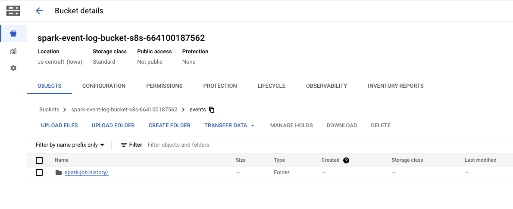
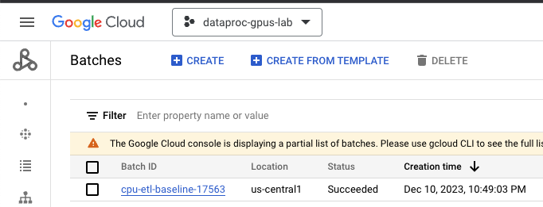
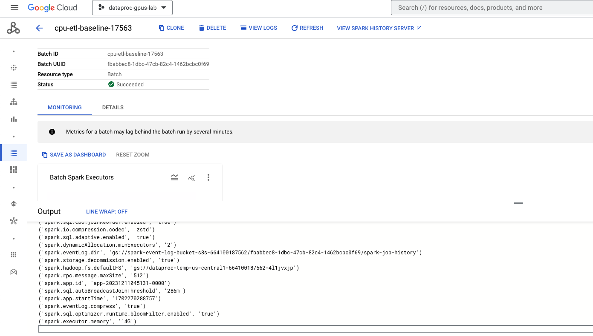

# Module-03: GPU acceleration for Spark on Dataproc Serverless


<hr>

## 1. About the lab

### 1.1. Prerequisites
Successful completion of prior module

<hr>

### 1.2. What to expect
In this lab, we will-

1. Create a Dataproc Persistent Spark History Server
2. Learn how to submit Spark jobs on Dataproc Serverless with GPUs
3. Visit the Spark History Server to review the execution DAG to review stages that benefited from GPU acceleration.
4. Understand how to use Nvidia command line tools showcased in Lab Module 2, with Dataproc Serverless
5. Know the limitations, know where to go for documentation and best practices

<hr>

### 1.3. Lab infrastructure

   
<br><br>

<hr>

### 1.4. Lab flow


<hr>

<hr>

### 1.5. Duration
~ 1 hour or less but does not require focus time.

<hr>
<hr>

## 2. Create a Persistent Spark History Server

This section should take 5 minutes to complete.

### 2.1. Provision the History Server
Paste the below in Cloud Shell-
```
PROJECT_ID=`gcloud config list --format "value(core.project)" 2>/dev/null`
PROJECT_NBR=`gcloud projects describe $PROJECT_ID | grep projectNumber | cut -d':' -f2 |  tr -d "'" | xargs`
DATAPROC_PHS_NAME=phs-${PROJECT_NBR}
PHS_BUCKET=spark-event-log-bucket-s8s-${PROJECT_NBR}
VPC_NM=VPC=vpc-$PROJECT_NBR
SPARK_SUBNET=spark-snet
UMSA_FQN=lab-sa@$PROJECT_ID.iam.gserviceaccount.com
REGION=us-central1
ZONE=us-central1-a
DPGCE_CLUSTER_BUCKET=spark-cluster-bucket-${PROJECT_NBR}


gcloud dataproc clusters create ${DATAPROC_PHS_NAME} \
    --project=$PROJECT_ID \
    --region=$REGION \
    --zone $ZONE \
    --single-node \
    --enable-component-gateway \
    --subnet=$SPARK_SUBNET \
    --properties "spark:spark.history.fs.logDirectory=gs://${PHS_BUCKET}/*/spark-job-history,spark:spark.eventLog.dir=gs://${PHS_BUCKET}/events/spark-job-history" \
    --service-account $UMSA_FQN   \
    --bucket $DPGCE_CLUSTER_BUCKET 
```

<hr>

### 2.2. Navigating to the Spark History Server

1. From the Cloud Console, search for Dataproc and from there, click on clusters. 
2. The cluster having a "phs" prefix is the persistent history server we just provisioned.
3. Below are the steps to navigate to the Spark History Server

   
<br><br>

   
<br><br>

   
<br><br>

   
<br><br>

   
<br><br>

   
<br><br>

<hr>
<hr>


## 3. Run the ETL job from module 2, to establish the CPU performance baseline

### 3.1. Execute the job

Paste in Cloud Shell-
```
PROJECT_ID=`gcloud config list --format "value(core.project)" 2>/dev/null`
PROJECT_NBR=`gcloud projects describe $PROJECT_ID | grep projectNumber | cut -d':' -f2 |  tr -d "'" | xargs`
PERSISTENT_SPARK_HISTORY_SERVER=phs-${PROJECT_NBR}
DATA_BUCKET=data_bucket-${PROJECT_NBR}
CODE_BUCKET=code_bucket-${PROJECT_NBR}
VPC_NM=VPC=vpc-$PROJECT_NBR
SPARK_SUBNET=spark-snet
UMSA_FQN=lab-sa@$PROJECT_ID.iam.gserviceaccount.com
REGION=us-central1
ZONE=us-central1-a
SPARK_JOB_PREFIX="cpu-etl-baseline"
DATAPROC_SERVERLESS_SPARK_RUNTIME="1.1"
INPUT_PREFIX="gs://data_bucket-$PROJECT_NBR/churn/input/10scale/"
OUTPUT_PREFIX="gs://data_bucket-$PROJECT_NBR/churn/output/cpu-based-analytics-serverless/"

gcloud dataproc batches submit \
--project $PROJECT_ID \
--region $REGION pyspark \
--batch $SPARK_JOB_PREFIX-$RANDOM gs://$CODE_BUCKET/churn/main_analytics_app.py \
--py-files=gs://$CODE_BUCKET/churn/aux_etl_code_archive.zip \
--version $DATAPROC_SERVERLESS_SPARK_RUNTIME \
--subnet $SPARK_SUBNET \
--history-server-cluster projects/$PROJECT_ID/regions/$REGION/clusters/$PERSISTENT_SPARK_HISTORY_SERVER \
--properties spark.dynamicAllocation.enabled=false,spark.executor.instances=4,spark.driver.cores=4,spark.executor.cores=8,spark.executor.memory=14G,spark.sql.codegen.wholeStage=false \
--service-account $UMSA_FQN \
-- --coalesce-output=8 --input-prefix=${INPUT_PREFIX} --output-prefix=${OUTPUT_PREFIX} 
```

In Dataproc Serverless, there is a fixed total of 3346 MB per core allocated for executor memory and executor overhead memory. The default configuration provided by Serverless, allocating 19120 MB for executor memory and 7648 MB for overhead memory, works optimally. This totals to (3346 * 8) MB. We can explicitly set these values in the arguments or leave them for Serverless to handle, as it essentially achieves the same outcome.

Follow the job execution in the Dataproc->Batches UI-

   
<br><br>
   
<br><br>
   
<br><br>

<hr>


### 3.2. Review the execution plan

Navigate to the Spark History Server and review the execution plan.

   
<br><br>
   
<br><br>
   
<br><br>
   
<br><br>

   
<br><br>

<hr>

### 3.3. Note the execution time

The CPU based execution took 15 minutes

<hr>
<hr>

## 4. Running the Nvidia Qualification Tool

- The Nvidia rapids user tools currently does not support Dataproc Serverless event logs directly.
- To run the qualification tool, copy the event logs from the Persistent Histroy Server bucket locally and run the tool as detailed in the lab module 2.

<hr>
<hr>

## 5. Run the same ETL job with GPUs

### 4.1. Execute the job

Paste in Cloud Shell-
```
PROJECT_ID=`gcloud config list --format "value(core.project)" 2>/dev/null`
PROJECT_NBR=`gcloud projects describe $PROJECT_ID | grep projectNumber | cut -d':' -f2 |  tr -d "'" | xargs`
PERSISTENT_SPARK_HISTORY_SERVER=phs-${PROJECT_NBR}
DATA_BUCKET=data_bucket-${PROJECT_NBR}
CODE_BUCKET=code_bucket-${PROJECT_NBR}
VPC_NM=VPC=vpc-$PROJECT_NBR
SPARK_SUBNET=spark-snet
UMSA_FQN=lab-sa@$PROJECT_ID.iam.gserviceaccount.com
REGION=us-central1
ZONE=us-central1-a
SPARK_JOB_PREFIX="gpu-etl-baseline"
DATAPROC_SERVERLESS_SPARK_RUNTIME="1.1"
INPUT_PREFIX="gs://data_bucket-$PROJECT_NBR/churn/input/10scale/"
OUTPUT_PREFIX="gs://data_bucket-$PROJECT_NBR/churn/output/gpu-based-analytics-serverless/"

gcloud dataproc batches submit \
--project $PROJECT_ID \
--region $REGION pyspark \
--batch $SPARK_JOB_PREFIX-$RANDOM gs://$CODE_BUCKET/churn/main_analytics_app.py \
--py-files=gs://$CODE_BUCKET/churn/aux_etl_code_archive.zip \
--version $DATAPROC_SERVERLESS_SPARK_RUNTIME \
--subnet $SPARK_SUBNET \
--history-server-cluster projects/$PROJECT_ID/regions/$REGION/clusters/$PERSISTENT_SPARK_HISTORY_SERVER \
--service-account $UMSA_FQN \
--properties \
"
spark.shuffle.manager=com.nvidia.spark.rapids.spark332.RapidsShuffleManager, \
spark.sql.codegen.wholeStage=false, \
spark.dynamicAllocation.enabled=false, \
spark.dataproc.driver.compute.tier=premium,\
spark.driver.memory=4g, \
spark.driver.cores=4, \
spark.dataproc.driver.disk.tier=premium,\
spark.dataproc.driver.disk.size=750g, \
spark.dataproc.executor.compute.tier=premium,\
spark.executor.instances=4, \
spark.executor.cores=8, \
spark.executor.memory=14G, \
spark.dataproc.executor.disk.tier=premium, \
spark.dataproc.executor.disk.size=1024, \
spark.dataproc.executor.resource.accelerator.type=l4,\
spark.rapids.memory.pinnedPool.size=4g, \
spark.rapids.sql.concurrentGpuTasks=3" \
-- --coalesce-output=8 --input-prefix=${INPUT_PREFIX} --output-prefix=${OUTPUT_PREFIX}
```

### 4.2. Note the execution time


### 4.3. Review the execution plan


<hr>
<hr>

## 5. Optimization summary


## 6. In closing


Dataproc and Nvidia GPUs can majorly accelerate ETL and Data Science worklads that use Spark SQL and Spark dataframes and optimize performance and thereby costs.

<br><br>
This concludes the lab. **DONT FORGET** to Shut down the project to avoid billing.

<hr>
<hr>


