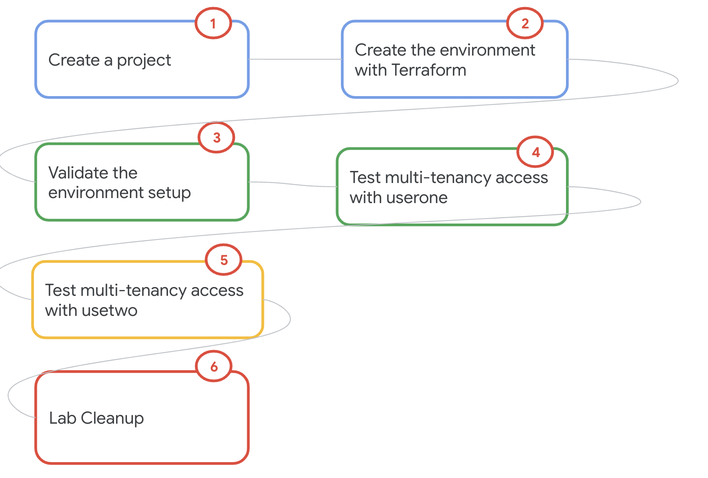

# Lab 8: GCE Cluster with Multitenancy

## 0. About the lab

### 0.1. Abstract
This lab TBD
<br>

## 0. About the lab

### 0.1. Abstract
This lab showcases running Dataproc on GCP in a cooperative multi-tenancy environment. <br><br>
It is based on [this blog](https://cloud.google.com/blog/topics/developers-practitioners/dataproc-cooperative-multi-tenancy/)

<hr>

### 0.2. Duration 
It takes ~1.5 hours to complete and is fully scrpited, including with Terraform for provisioning.


<hr>

### 0.3. Resources provisioned
Covered in section 3.1


<hr>

### 0.4. Prerequisites

- A pre-created project
- You need to have organization admin rights, and project owner privileges or work with privileged users to complete provisioning.


<hr>

### 0.5. Lab format

- Includes Terraform for provisioning automation
- Is fully scripted - the entire solution is provided, and with instructions
- Is self-paced/self-service


<hr>

### 0.6. Audience

- A quick read for architects
- Targeted for hands on practitioners, especially data engineers


<hr>

### 0.7. Features covered

| Functionality | Feature | 
| -- | :--- | 
| Spark platform |  Dataproc on GCE |
| Spark History Server |  Dataproc **Persistent** Spark History Server |

<br><br>

<hr>

### 0.8. Lab Flow

   
<br><br>

<hr>

### 0.14. For success

Read the lab - narrative below, review the code, and then start trying out the lab.

<hr>


## 1. Clone this repo in Cloud Shell

```
git clone https://github.com/anagha-google/dataproc-labs.git
```

<hr>

## 2. Foundational provisioning automation with Terraform 
The Terraform in this section updates organization policies and enables Google APIs.<br>

1. Paste this in Cloud Shell
```
cd ~/dataproc-labs/8-dataproc-gce-with-multitenancy/provisioning-automation/foundations-tf
```

2. Run the Terraform for organization policy edits and enabling Google APIs
```

PROJECT_ID=`gcloud config list --format "value(core.project)" 2>/dev/null`

terraform init
terraform apply \
  -var="project_id=${PROJECT_ID}" \
  -auto-approve
  ```

**Note:** Wait till the provisioning completes (~10 minutes) before moving to the next section.


<hr>

## 3. Lab resources provisioning automation with Terraform 

### 3.1. Resources provisioned
In this section, we will provision-
1. Network, subnet, firewall rule
2. Storage buckets for code, datasets, and for use with the services
4. Persistent Spark History Server
5. Dataproc Metastore
8. User Managed Service Account
9. Requisite IAM permissions


### 3.2. Run the terraform scripts

1. Paste this in Cloud Shell after editing the GCP region variable to match your nearest region-

```
cd ~/dataproc-labs/8-dataproc-gce-with-multitenancy/provisioning-automation/core-tf/terraform
```

```

PROJECT_ID=`gcloud config list --format "value(core.project)" 2>/dev/null`
PROJECT_NBR=`gcloud projects describe $PROJECT_ID | grep projectNumber | cut -d':' -f2 |  tr -d "'" | xargs`
PROJECT_NAME=`gcloud projects describe ${PROJECT_ID} | grep name | cut -d':' -f2 | xargs`
GCP_ACCOUNT_NAME=`gcloud auth list --filter=status:ACTIVE --format="value(account)"`
DEPLOYER_ACCOUNT_NAME=$GCP_ACCOUNT_NAME
ORG_ID=`gcloud organizations list --format="value(name)"`
ORG_NAME=`gcloud organizations list --format="value(display_name)"`
# these users should exist in your organization; if not create them or change the usernames 
# to match existing users in your organization
USERONE="user1"
USERTWO="user2"
SERVICEONE="user1-service"
SERVICETWO="user2-service"

```

2. Run the Terraform for provisioning the rest of the environment
```
terraform init
terraform apply \
  -var="project_id=${PROJECT_ID}" \
  -var="org_name=${ORG_NAME}" \
  -var="userone=${USERONE}" \
  -var="usertwo=${USERTWO}" \
  -var="serviceone=${SERVICEONE}" \
  -var="servicetwo=${SERVICETWO}" \
  -auto-approve
```

**Note:** Takes ~45 minutes to complete.

<br>

## 4. Explore the resources provisioned

Paste the following variables in Cloud Shell-
```
PROJECT_ID=`gcloud config list --format "value(core.project)" 2>/dev/null`
PROJECT_NBR=`gcloud projects describe $PROJECT_ID | grep projectNumber | cut -d':' -f2 |  tr -d "'" | xargs`
```

### 4.1. GCS bucket for code

Run this command in Cloud Shell-
```
gsutil ls -r gs://dataproc_mt_bucket-${PROJECT_NBR}
```

### 4.2. Persistent Spark History Server (PHS)

- Validate the creation of the PHS from the Cloud Console, Dataproc UI -> Clusters
- The PHS has a name prefix - "dpgce-sphs-"
- Navigate to web interfaces, then "Spark History Server" and familiarize yourself with the UI

### 4.3. Dataproc on GCE cluster (DPGCE)

- Validate the creation of the Dataproc on GCE cluster from the Cloud Console, Dataproc UI -> Clusters
- The DPGCE has a name prefix - "	dpgce-cluster-static-"
- Click on all the tables of the cluster details and review the configuration
- Under configuration, check for the metastore configuration
- And check for the Spark History Server bucket configuration


<hr>

## 5. Run the Spark jobs individually (log into the GCP console as user1)

Paste the following variables in Cloud Shell 
```
PROJECT_ID=`gcloud config list --format "value(core.project)" 2>/dev/null`
PROJECT_NBR=`gcloud projects describe $PROJECT_ID | grep projectNumber | cut -d':' -f2 |  tr -d "'" | xargs`
LOCATION=us-central1
VPC_NM=default
SPARK_SERVERLESS_SUBNET=default
PERSISTENT_HISTORY_SERVER_NM=dpgce-sphs-${PROJECT_NBR}
UMSA_FQN=dpgce-lab-sa@$PROJECT_ID.iam.gserviceaccount.com
GCE_BUCKET=dataproc_mt_bucket-${PROJECT_NBR}
DPGCE_CLUSTER_NAME=dpgce-cluster-static-${PROJECT_NBR}

echo $PROJECT_ID
echo $PROJECT_NBR
echo $LOCATION
echo $VPC_NM
echo $SPARK_SERVERLESS_SUBNET
echo $PERSISTENT_HISTORY_SERVER_NM
echo $UMSA_FQN
echo $GCE_BUCKET
echo $DPGCE_CLUSTER_NAME

```

### 5.1. Run as user one (log into the GCP console as user1)
<br>

```
gcloud dataproc jobs submit pig --region ${LOCATION} \
--cluster ${DPGCE_CLUSTER_NAME} \
-e "sh whoami; sh klist; sh gcloud auth list;"

```
<br>
The output should look similar to the results below:
<br>

```
user1
Ticket cache: FILE:/tmp/krb5cc_1003
Default principal: user2/dpgce-cluster-static-15841212480-m.us-central1-c.c.dataproc-mtv5.internal@US-CENTRAL1-C.C.DATAPROC-MTV5.INTERNAL

Valid starting     Expires            Service principal
05/01/24 23:46:07  05/02/24 09:46:07  krbtgt/US-CENTRAL1-C.C.DATAPROC-MTV5.INTERNAL@US-CENTRAL1-C.C.DATAPROC-MTV5.INTERNAL
        renew until 05/08/24 23:46:07
                   Credentialed Accounts
ACTIVE  ACCOUNT
*       user2-service@dataproc-mtv5.iam.gserviceaccount.com
```


### 5.2. Run as User two (log into the GCP console as user2)

Paste the following variables in Cloud Shell
```
PROJECT_ID=`gcloud config list --format "value(core.project)" 2>/dev/null`
PROJECT_NBR=`gcloud projects describe $PROJECT_ID | grep projectNumber | cut -d':' -f2 |  tr -d "'" | xargs`
LOCATION=us-central1
VPC_NM=default
SPARK_SERVERLESS_SUBNET=default
PERSISTENT_HISTORY_SERVER_NM=dpgce-sphs-${PROJECT_NBR}
UMSA_FQN=dpgce-lab-sa@$PROJECT_ID.iam.gserviceaccount.com
GCE_BUCKET=dataproc_mt_bucket-${PROJECT_NBR}
DPGCE_CLUSTER_NAME=dpgce-cluster-static-${PROJECT_NBR}

echo $PROJECT_ID
echo $PROJECT_NBR
echo $LOCATION
echo $VPC_NM
echo $SPARK_SERVERLESS_SUBNET
echo $PERSISTENT_HISTORY_SERVER_NM
echo $UMSA_FQN
echo $CODE_AND_DATA_BUCKET
echo $DPGCE_CLUSTER_NAME

```

```
gcloud dataproc jobs submit pig --region ${LOCATION} \
--cluster ${DPGCE_CLUSTER_NAME} \
-e "sh whoami; sh klist; sh gcloud auth list;"

```
<br>
The output should look similar to the results below:

```
user1
Ticket cache: FILE:/tmp/krb5cc_1003
Default principal: user2/dpgce-cluster-static-15841212480-m.us-central1-c.c.dataproc-mtv5.internal@US-CENTRAL1-C.C.DATAPROC-MTV5.INTERNAL

Valid starting     Expires            Service principal
05/01/24 23:46:07  05/02/24 09:46:07  krbtgt/US-CENTRAL1-C.C.DATAPROC-MTV5.INTERNAL@US-CENTRAL1-C.C.DATAPROC-MTV5.INTERNAL
        renew until 05/08/24 23:46:07
                   Credentialed Accounts
ACTIVE  ACCOUNT
*       user2-service@dataproc-mtv5.iam.gserviceaccount.com
```


### 5.3. Run Java WordCount as user one (log into the GCP console as user1)


```
PROJECT_ID=`gcloud config list --format "value(core.project)" 2>/dev/null`
PROJECT_NBR=`gcloud projects describe $PROJECT_ID | grep projectNumber | cut -d':' -f2 |  tr -d "'" | xargs`
DPGCE_CLUSTER_NAME=dpgce-cluster-static-${PROJECT_NBR}
GCE_BUCKET=dataproc_mt_bucket-${PROJECT_NBR}
LOCATION=us-central1

echo "This is a simple file" | gsutil cp - gs://${GCE_BUCKET}/file

gcloud dataproc jobs submit spark --region=${LOCATION} --cluster=${DPGCE_CLUSTER_NAME} \
     --class=org.apache.spark.examples.JavaWordCount \
    --jars=file:///usr/lib/spark/examples/jars/spark-examples.jar -- gs://${GCE_BUCKET}/file

```

<br>
The output should look similar to the results below:
<br>

```
is: 1
a: 1
simple: 1
This: 1
file: 1

```

### 5.4. Run Java WordCount as user one (log into the GCP console as user2)

```
PROJECT_ID=`gcloud config list --format "value(core.project)" 2>/dev/null`
PROJECT_NBR=`gcloud projects describe $PROJECT_ID | grep projectNumber | cut -d':' -f2 |  tr -d "'" | xargs`
DPGCE_CLUSTER_NAME=dpgce-cluster-static-${PROJECT_NBR}
GCE_BUCKET=dataproc_mt_bucket-${PROJECT_NBR}
LOCATION=us-central1

gcloud dataproc jobs submit spark --region=${LOCATION} --cluster=${DPGCE_CLUSTER_NAME} \
    --class=org.apache.spark.examples.JavaWordCount \
    --jars=file:///usr/lib/spark/examples/jars/spark-examples.jar -- gs://${GCE_BUCKET}/file.txt

```

Results should look similar to those below: 
<br>

```
Caused by: com.google.cloud.hadoop.repackaged.gcs.com.google.api.client.googleapis.json.GoogleJsonResponseException: 403 Forbidden
GET https://storage.googleapis.com/storage/v1/b/dataproc_mt_bucket-15841212480/o/file.txt?fields=bucket,name,timeCreated,updated,generation,metageneration,size,contentType,contentEncoding,md5Hash,crc32c,metadata
{
  "code" : 403,
  "errors" : [ {
    "domain" : "global",
    "message" : "user2-service@dataproc-mtv5.iam.gserviceaccount.com does not have storage.objects.get access to the Google Cloud Storage object. Permission 'storage.objects.get' denied on resource (or it may not exist).",
    "reason" : "forbidden"
  } ],
  "message" : "user2-service@dataproc-mtv5.iam.gserviceaccount.com does not have storage.objects.get access to the Google Cloud Storage object. Permission 'storage.objects.get' denied on resource (or it may not exist)."
}
```

### 5.5. Run Hive Workload as user one (log into the GCP console as user1)

```
PROJECT_ID=`gcloud config list --format "value(core.project)" 2>/dev/null`
PROJECT_NBR=`gcloud projects describe $PROJECT_ID | grep projectNumber | cut -d':' -f2 |  tr -d "'" | xargs`
DPGCE_CLUSTER_NAME=dpgce-cluster-static-${PROJECT_NBR}
GCE_BUCKET=dataproc_mt_bucket-${PROJECT_NBR}
LOCATION=us-central1

gcloud dataproc jobs submit hive --region=${LOCATION} --cluster=${DPGCE_CLUSTER_NAME} \
 -e "create external table if not exists employee (eid int, name String) location 'gs://${GCE_BUCKET}/employee'; insert into employee values (1, 'alice'), (2, 'bob');select * from employee;"
```

<br>

Results should look similar to those below: <br>


```
Connecting to jdbc:hive2://<CLUSTER_NAME>-m:10000
Connected to: Apache Hive (version 2.3.7)
Driver: Hive JDBC (version 2.3.7)
Transaction isolation: TRANSACTION_REPEATABLE_READ
No rows affected (0.538 seconds)
No rows affected (27.668 seconds)
+---------------+----------------+
| employee.eid  | employee.name  |
+---------------+----------------+
| 1             | alice          |
| 2             | bob            |
+---------------+----------------+
2 rows selected (1.962 seconds)
Beeline version 2.3.7 by Apache Hive
Closing: 0: jdbc:hive2://<CLUSTER_NAME>-m:10000
Job [ea9acf13205a44dd...] finished successfully.
done: true

```

### 5.6. Run Hive Workload as usertwo (log into the GCP console as user2)

```
PROJECT_ID=`gcloud config list --format "value(core.project)" 2>/dev/null`
PROJECT_NBR=`gcloud projects describe $PROJECT_ID | grep projectNumber | cut -d':' -f2 |  tr -d "'" | xargs`
DPGCE_CLUSTER_NAME=dpgce-cluster-static-${PROJECT_NBR}
GCE_BUCKET=dataproc_mt_bucket-${PROJECT_NBR}
LOCATION=us-central1

gcloud dataproc jobs submit hive --region=${LOCATION} --cluster=${DPGCE_CLUSTER_NAME} \
 -e "select * from employee;"

```

<br>
Results should look similar to those below: <br>

```
gcloud config set account ${SECOND_USER}
gcloud dataproc jobs submit hive --region=${LOCATION} --cluster=${CLUSTER_NAME} \
  -e "select * from employee;"

GET https://storage.googleapis.com/storage/v1/b/<GCE_BUCKET>/o/employee
{
  "code" : 403,
  "errors" : [ {
    "domain" : "global",
    "message" : "user2-service@dataproc-mtv5.iam.gserviceaccount.com does not have storage.objects.get access to the Google Cloud Storage object.",
    "reason" : "forbidden"
  } ],
  "message" : "user2-service@dataproc-mtv5.iam.gserviceaccount.com does not have storage.objects.get access to the Google Cloud Storage object."
}


user2@cloudshell:~ (dataproc-mtv5)$ gsutil ls gs://${GCE_BUCKET}
AccessDeniedException: 403 user2-service@dataproc-mtv5.iam.gserviceaccount.com does not have storage.objects.list access to the Google Cloud Storage bucket. Permission 'storage.objects.list' denied on resource (or it may not exist).
user2@cloudshell:~ (dataproc-mtv5)$ 

```
